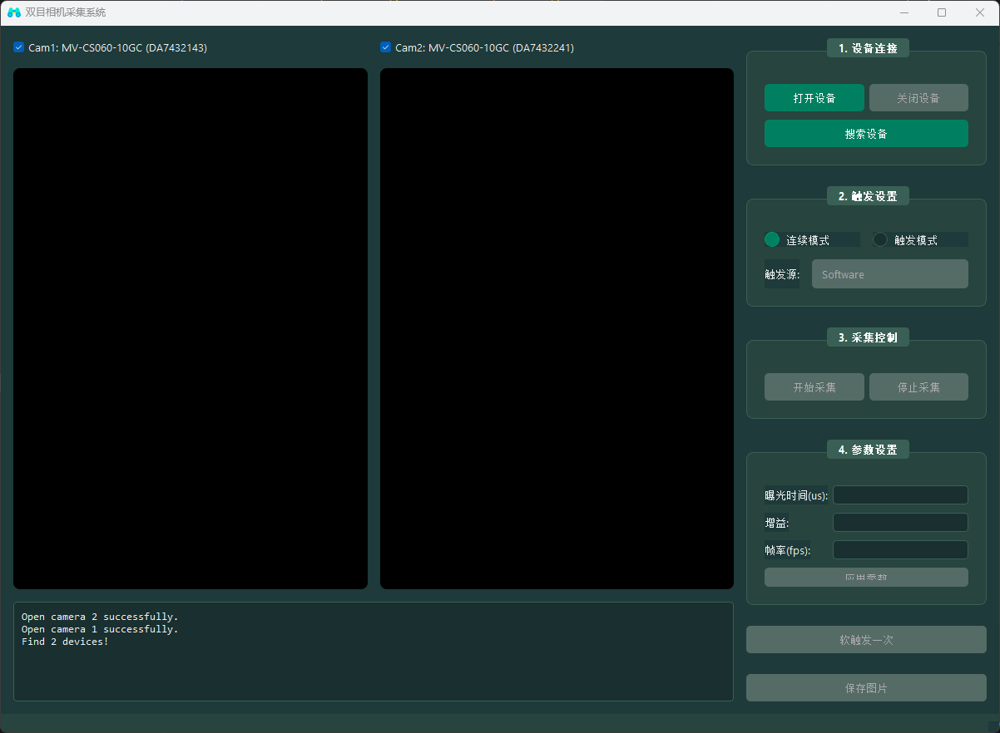

## 项目说明
本项目基于海康工业相机SDK,基于Python接口开发了双目相机采集客户端

## 项目功能进度
### 已完成功能
- [x] 支持任意数量相机的连接
- [x] 触发模式支持软同步、硬同步
- [x] 软同步触发保存图像到本地，采集误差1ms
- [x] 帧率、增益、曝光时间设置
- [x] Pyinstaller打包发布

### 待完成功能
- [ ] 点击画面任意一点，获取深度信息

## 技术文档
[官方技术说明](https://www.hikrobotics.com/cn/machinevision/visionproduct?typeId=27&id=249&pageNumber=1&pageSize=20&showEol=false)

[硬触发技术文档](开发说明.md)
