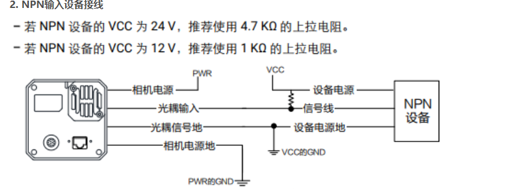

## 工业相机触发介绍
采集图像数据分为外触发和内触发两种模式。内触发分为实时视频流和单帧采集，在海康相机中，实时视频为**连续模式**。设置为**触发模式**时，相机不自动送图像数据，需要触发指令才送数据，触发源可以是软件或者外部电平信号。
### 硬件触发
#### 引脚定义

根据现场使用需求，可以选择不同的触发方式，以下是几种典型方法：
#### PNP型传感器

这张图展示的是如何将一个**PNP型传感器**连接到一个相机的光耦隔离输入口，以实现硬件触发。
首先，要理解一个关键概念：在工业自动化中，PNP和NPN是描述三线直流传感器输出类型的术语

*   **NPN传感器**：使用 **NPN型三极管**，开关连接在 **输出(OUT)和地(GND)** 之间。它决定了输出端**是否接地**。
*   **PNP传感器**：使用 **PNP型三极管**，开关连接在 **电源(VCC)和输出(OUT)** 之间。它决定了输出端**是否接电源**。

可以把整个电路图分为三部分：

1.  **左侧：相机接口**
    *   **相机电源 (Camera Power)**：给相机主板供电的正极。连接到电源 `PWR`。
    *   **光耦输入 (Optocoupler Input)**：这是相机用来接收外部触发信号的关键引脚。它在相机内部连接到一个光电耦合器的正极（LED的阳极）。
    *   **光耦信号地 (Optocoupler Signal Ground)**：光电耦合器的负极（LED的阴极）。
    *   **相机电源地 (Camera Power Ground)**：相机主板供电的负极。连接到电源的 `GND`。

2.  **右侧：PNP设备 (通常是传感器)**
    *   **设备电源 (Device Power)**：传感器的供电正极。
    *   **信号线 (Signal Line)**：传感器的信号输出线。**对于PNP型，当被触发时，这条线会输出高电平（+VCC）。**
    *   **设备电源地 (Device Ground)**：传感器的供电负极。

3.  **中间：电源与连接**
    *   **PWR**: 代表相机的供电电源正极。
    *   **VCC**: 代表传感器的供电电源正极。图中 `PWR` 和 `VCC` 是分开的，意味着它们可以由不同的电源供电，但通常为了简化，会使用同一个电源。
    *   **GND (地)**: 所有电路的公共参考点（0V）。

模拟一下传感器触发的瞬间，电流是如何流动的：

1.  **未触发状态**：
    *   PNP设备开关断开，通常相机内部会有下拉电阻，**信号线**处于低电平状态没有电流输出。
    *   相机内部的光耦LED没有电流流过，处于熄灭状态。
    *   相机没有收到触发信号。

2.  **触发状态**：
    *   PNP设备（例如，一个光电传感器检测到物体）被触发。
    *   根据PNP的特性，其**信号线**立即输出一个**高电平**（+VCC）。
    *   此时，形成了一个完整的电流回路：
        *   电流从 **PNP设备的信号线** 流出 (+VCC)。
        *   进入相机的 **光耦输入** 引脚。
        *   流过相机内部的光耦LED。
        *   从 **光耦信号地** 引脚流出。
        *   最后流回到 **公共地 (GND)**。
    *   相机内部的光耦LED因为有电流流过而发光，触发了另一侧的光敏三极管，从而向相机主处理器发送了一个“触发”信号。
    *   相机收到信号后，执行一次拍照。

#### NPN型传感器

NPN指的是N-P-N型三极管，如果不接上拉电阻，这个电压就是处于**未定义**状态，可能触发，也可能不触发，不稳定

如上图所示，接了上拉电阻，光耦输入引脚是一个高电平状态，当集电极被触发是，开关导通，由于三极管内部电阻小于上拉电阻，所以光耦输入引脚会变成一个**低电平**状态，从而触发光耦，从而触发相机。

#### 上拉电阻和下拉电阻

PNP和NPN的根本区别在于它们内部使用的**三极管类型**以及这个“电子开关”在电路中的**位置**。

NPN的工作原理如下：
*   **内部电路**：开关在OUT和GND之间。
*   **工作方式**：
    *   **未触发**：开关**断开**。OUT引脚什么都不接，电压处于**未定义**状态。
    *   **触发**：开关**闭合**。OUT引脚被连接到**GND (0V)**。
*   **问题**：未触发时的“悬空”状态是**不确定的**。
*   **解决方案**：在外部用一个**上拉电阻**连接到VCC。这个电阻的作用是，当NPN内部的开关断开时，它能把OUT引脚的电压“拉”到VCC，提供一个**默认的高电平**。当开关闭合时，由于三极管内部电阻比较下，此时信号线会被拉低。**OUT引脚**会变成一个**低电平**状态。

再来对比一下两种传感器输出的两种状态：

| | NPN (接地开关) | PNP (接电源开关) |
| :--- | :--- | :--- |
| **能确定的输出** | **低电平 (0V)** | **高电平 (+V)** |
| **不确定的输出** | 高电平状态 (悬空) | 低电平状态 (高阻) |
| **如何稳定电路** | **需要外部上拉电阻** (连接到VCC) | **依赖接收设备内部的下拉电阻** (连接到GND) |
| **别名** | 漏型 (Sinking)，灌电流 | 源型 (Sourcing)，源电流 |
| **电流方向** | 触发时，电流从外部**流入**传感器 | 触发时，电流从传感器**流出**到外部 |

**NPN自己搞不定高电平，需要上拉电阻帮忙；PNP自己搞不定低电平，需要接收设备（如相机）内部的下拉电阻帮忙。**

因为接收设备内部通常都设计有下拉电阻，所以对于用户来说，接PNP传感器时就无需再额外添加元件了。而上拉电阻则因为不同的VCC电压需要不同的阻值，所以通常需要用户根据情况在外部添加。

#### 外接开关设备

外接开关设备时，其电气行为等效于外接PNP设备。

#### 触发源选择
PNP和开关设备，选择上升沿触发，NPN设备选择下降沿触发